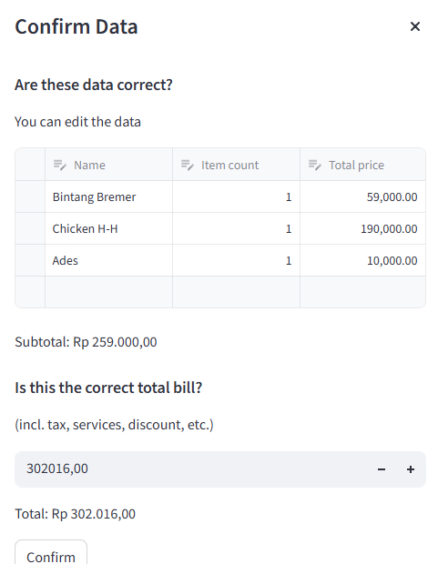
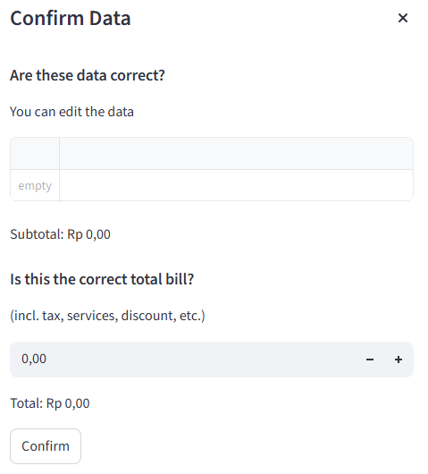
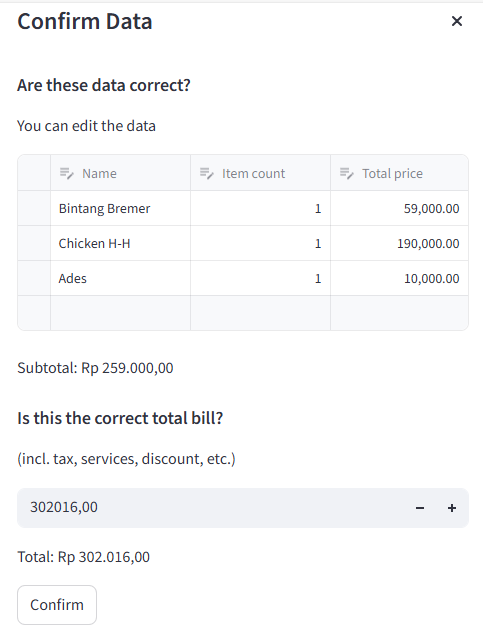
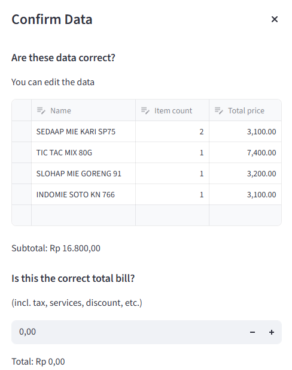

# Split Bill Application

This project compares two models for extracting structured data from receipt images: Donut and docTR.

Courtesy of: https://github.com/MukhlasAdib

## Features

With this application, you can upload a photo of your receipt. The AI will read the receipt and show you the data.


Then, you can list participants of your split-bill, and then assign items from the receipt to each of them.


When you are done, final report will be shown.


## Installation

1. Make sure Python is installed (any recent version should be fine, I tested with Python 3.12)
2. Create environment for this application

with virtualenv:

```bash
    pip install virtualenv
    python -m virtualenv .ven
```
with uv:

```bash
    uv sync
```

3. Activate the environment

if using Linux

```bash
    source .venv/bin/activate
```

if using Windows

```powershell
    .\.venv\Scripts\activate
```

4. Install required libraries

with virtualenv:

```bash
    pip install -r requirements.txt
```
with uv:

```bash
    uv sync
```

## Run Application

1. Activate the environment

if using Linux

```bash
    source .venv/bin/activate
```

if using Windows

```powrshell
    .\.venv\Scripts\activate
```

2. Start the app

with virtualenv:

```bash
    streamlit run app.py
```

with uv:


```bash
    uv run streamlit run app.py
```

## Demo Video

[GDrive](https://drive.google.com/file/d/1rxxo9BSJJhJYQBuqnZDkkhdYfvM7PZg5/view?usp=sharing)

## Hasil Ekstraksi Model

- Donut (Receipt 1)

  

- Donut (Receipt 2)

  

- docTR (Receipt 1)

  

- docTR (Receipt 2)

  
  
## Hasil Analisis Model

1. Donut:
- Tidak berhasil membaca bill kedua
- Kurang fleksibel terhadap variasi layout bill
- Kecepatan relatif lambat (39 detik)

2. docTR:
- Berhasil membaca bill kedua, namun: terdapat item tidak terbaca (misalnya Delfi), satu item terbaca kurang jelas (Sedaap), tidak mampu mendeteksi total belanja
- Sensitif terhadap lighting dan kualitas foto
- Jauh lebih cepat (9-10 detik)

## Alasan Pemilihan Model

1. Donut: Dipilih karena merupakan model end-to-end yang langsung mengubah gambar menjadi structured data, sehingga secara konsep lebih efisien.

2. docTR: Dipilih karena mampu menangani layout bill yang kompleks dan lebih fleksibel terhadap variasi struktur dokumen

## Evaluasi Kualitatif

1. Model Pembaca Bill
    - Kecepatan:
    docTR lebih cepat, Donut lebih lambat

    - Akurasi:
    docTR belum 100% akurat (missing item dan gagal baca total) sedangkan Donut belum berhasil mengekstrak bill lain

2. Produk Web

   Fitur utama sudah berjalan sesuai alur namun masih terdapat bug UX, terutama pada pop-up hasil ekstraksi yang tertutup jika memakai scroll bar

## Kelemahan 

1. Model Pembaca Bill
- Sangat sensitif terhadap lighting dan kualitas gambar
- Teks “Total” pada bill kedua gagal terdeteksi
- Donut tidak robust terhadap variasi bill di luar data latih

2. Produk Web

Pop-up hasil ekstraksi yang tertutup jika memakai scroll bar

## Ide Improvement
- Menambahkan image preprocessing (brightness, contrast)
- Fine-tuning Donut dengan variasi bill lokal
- Mengkombinasikan OCR + post-processing untuk meningkatkan akurasi total
